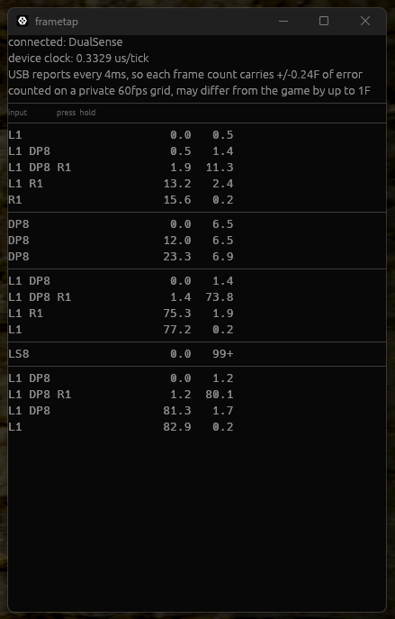

# frametap

Read your own controller inputs frame by frame, next to the game.



## What it is

A small always-on-top window that lists what you pressed and for how long, counted in frames. It reads the controller directly over HID, so it works with any game. It never writes to the controller.

It was built for one question: *was that attack 1 frame late, or did the game drop it?* The list answers the first half. Each row carries the frame the input started and the number of frames it was held, both to one decimal place.

## What you need

- Windows 10 or 11
- A DualSense, DualSense Edge, or DualShock 4, over USB or Bluetooth
- Nothing else. No driver, no runtime, no Visual C++ redistributable

## Install

Download the latest [release](https://github.com/torabit/frametap/releases), put `frametap.exe` and `frametap.toml` in the same folder, and run the exe.

The exe is unsigned, so SmartScreen will warn on first run. Choose **More info** and then **Run anyway**. If your antivirus quarantines it, please open an issue with a screenshot rather than adding an exclusion.

## Reading the list

```
frametap 0.1.2  connected: DualSense
device clock: 0.3274 us/tick
USB reports every 4ms, so each frame count carries +/-0.24F of error
counted on a private 60fps grid, may differ from the game by up to 1F

input                press  hold
LS8                    0.0   1.0
LS8 Circle             1.0   2.0
LS8                    3.0  15.0
LS8 R1                18.0   2.0
```

| Column | Meaning |
| --- | --- |
| `input` | Everything held during that interval, in the order it was pressed |
| `press` | Frames since the first press of the attempt |
| `hold` | How long that exact combination lasted. Capped at `99+` |

A new row appears only when the set of held inputs changes. Holding a direction for two seconds is one row whose `hold` keeps growing, not a hundred rows.

Directions use numpad notation. `DP8` is d-pad up, `LS8` is left stick up, `LS6` is right, `LS2` is down. The prefix separates the d-pad from the stick, because the game sees both but you may want to know which one you used.

A horizontal rule separates attempts. An attempt ends after 300ms with nothing held.

The window keeps recording while it is completely covered by another window, so you can leave it behind the game and read it afterwards.

A row with a grey background means a report was dropped between it and the row above. The gap is real and the tool will not interpolate across it, so treat that interval's timing as unknown.

## The frame count is not the game's frame count

The tool samples the controller at 250Hz and divides elapsed time by a 60fps grid of its own. The game reads the pad once per frame, at an instant nothing outside the game can observe. Those two grids are not in phase.

A number here can therefore be one frame away from what the game counted. Two inputs 10ms apart may land in the same game frame or in adjacent ones, and this tool cannot tell you which. That is why the counts carry a decimal: `3.0` and `3.4` are different measurements even though both would print as `3` in a game's own input display.

## Configuration

`frametap.toml` sits next to the exe. It is optional; without it the defaults apply. Anything the tool cannot accept is reported in red at the top of the window rather than silently ignored.

| Key | Default | Meaning |
| --- | --- | --- |
| `fps` | `60` | The frame rate the counts are expressed in |
| `trial_gap_ms` | `300` | Idle time that ends an attempt |
| `stick_deadzone` | `0.5` | Normalized distance before the stick counts as a direction |
| `trials_shown` | `5` | How many attempts to keep on screen |
| `show_released` | `false` | Also list the intervals where nothing was held |

## When it crashes

There is no console window, so a panic writes `frametap-panic.txt` next to the exe instead, appending rather than overwriting. Please attach that file to an issue.

If the exe cannot write to its own folder, the file goes to your temp directory.

## Probing a controller that is not supported yet

`hid_probe.exe`, attached to every release, reads a device and prints the raw reports. Use it to find out whether an unsupported pad speaks a format this tool could decode.

```
hid_probe.exe --list                     list every connected HID device
hid_probe.exe --vid 0x0F0D --pid 0x0084  open one of them and dump its reports
```

`--list` only enumerates; it never opens a device, so it will not fight with a game over one. The dump prints the first three reports as hex and the min, median and max interval between 300 reports.

Open an issue with that output and the controller's name.

## Limitations

- Windows only. The HID and timing code has no other implementation
- It opens the controller read-only and never sends output or feature reports, so it cannot fight with Steam Input over the device
- The byte layout for DualShock 4 is taken from Linux's `hid-playstation` and has not been checked against real hardware. DualSense has been

## Building

```
cargo build --release
```

Requires a Rust toolchain. `cargo run --example demo` opens the window with synthetic input and no controller attached, which is useful for working on the display itself.

## License

MIT. See [LICENSE](LICENSE).
